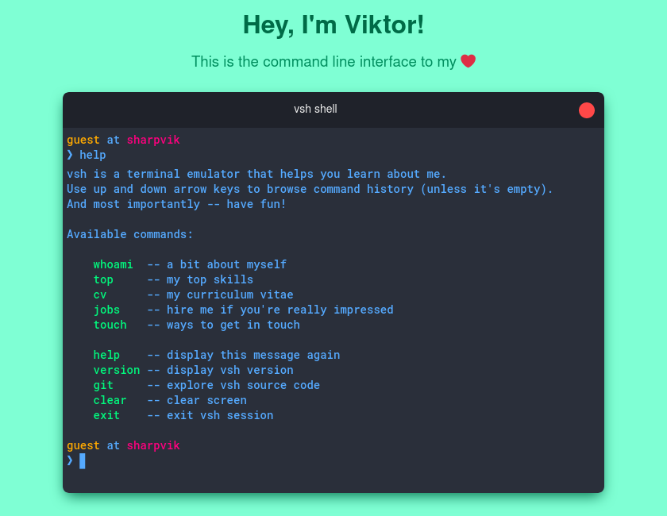

# vsh

**Note:** In order to properly emulate a terminal, I had to ditch `textarea` and
use a plain `div` block, capturing key presses manually. Therefore, this app
will **not** work on mobile devices, unless your phone happens to have a
keyboard connected to it.
